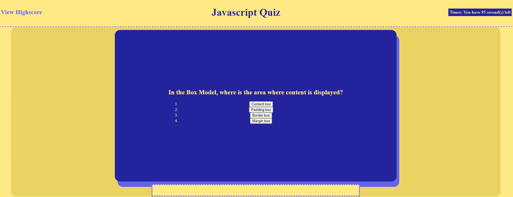

# Coding-Quiz-IV
Link to Github Application:https://azuryte5.github.io/Coding-Quiz-IV/

Link to Github Repository: https://github.com/azuryte5/assignment4-quiz

## User Story
AS A coding boot camp student
I WANT to take a timed quiz on JavaScript fundamentals that stores high scores
SO THAT I can gauge my progress compared to my peers
* Spent 30hrs on this assignment. I struggled to come up with a way to trace answers and progress through quiz on display.
* I came up with a working solution that uses var count to track which question the user is on and when to stop and move to endgame screen.

## List of events/functions in application:

* 1) When start button is clicked startGame() runs

* 2) startGame () set ups the section display with the possible answers lists, runs countdown () and questions ()

* 3) a) countdown () is a clock and holds the timer/score. It has 3 stopping conditions as described in comments. When game ends setInterval is cleared and endGame() runs

* 3) b) questions() uses var count to know which question to display and when it is out of questions and has to end. After an answer is given by user, the next question() is fired and runs with count++. If count hits the end it stops and goes to endGame()

* 4) wrongAnswer() or rightAnswer () function will run when an answer is given passed on the count gate I made based on where count was when an answer button was clicked.

* 5) endGame () runs when countdown () end by either count going to 5 or timer hitting 0. EndGame takes the timer score and offers the user to submit data to be stored on highScore(). On submit, highScore() will run

* 6) highScore () runs and changes display to show standings. Try again and reset buttons are present. Try again will relaunch a new game. Reset will clear the scores and any extra li that happen to exist.

Bug:  There is a bug where the scoreboard persists on display a new game. Reset does clear it along with any other li's. There is also a bug where repeated clicks on  view HighScore to Try Again will really speed up the timer countdown. This is likely due to a game not being completed and resetting the functions fully. 

## Acceptance Criteria
GIVEN I am taking a code quiz
WHEN I click the start button
[✅ ]THEN a timer starts and I am presented with a question
WHEN I answer a question
[✅ ]THEN I am presented with another question
WHEN I answer a question incorrectly
[✅]THEN time is subtracted from the clock
WHEN all questions are answered or the timer reaches 0
[✅ ]THEN the game is over
WHEN the game is over
[✅]THEN I can save my initials and score

